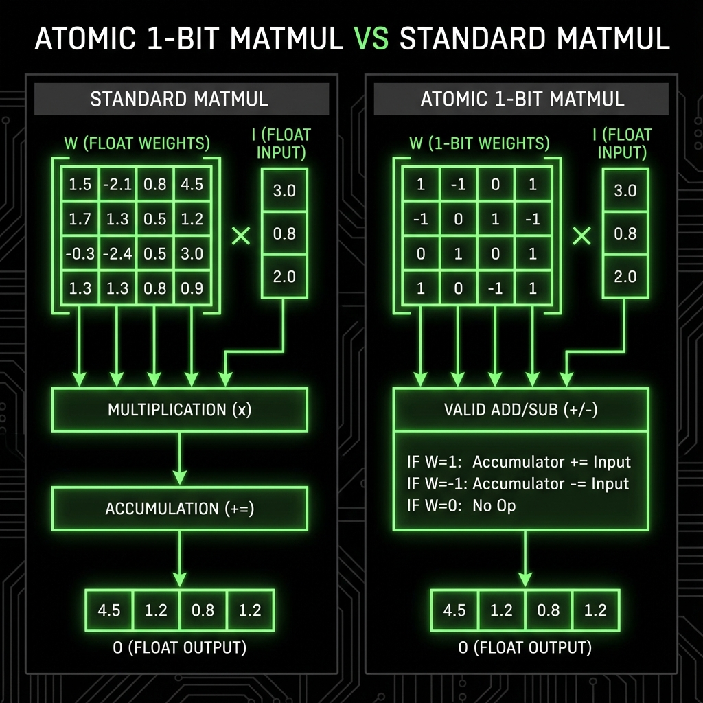

[](https://opensource.org/licenses/MIT)
[](https://www.python.org/downloads/)
[](https://isocpp.org/)
[](#how-it-works)

# Atomic-1Bit

**Run language models using only addition and subtraction.** Atomic-1Bit is a bare-metal inference engine for 1.58-bit ternary models (BitNet b1.58) that replaces floating-point matrix multiplication with integer add/sub operations, cutting model size by 62% and enabling deployment on devices as small as an ESP32.

## Why Atomic-1Bit?

Most LLM inference requires expensive GPU hardware and gigabytes of memory. Even "small" models assume you have a modern GPU or at least a fast CPU with plenty of RAM.

Atomic-1Bit takes a different approach. By quantizing weights to just three values **{-1, 0, 1}**, we eliminate floating-point multiplication entirely:

```
weight ==  1  ->  accumulator += input
weight == -1  ->  accumulator -= input
weight ==  0  ->  skip  (free sparsity)
```

The result is a full transformer that runs on **integer arithmetic only**. No CUDA required. No FP16. No matrix multiply units. Just `add` and `sub` instructions that work on any processor manufactured in the last 30 years.

**This matters because:**
- A 1.33M parameter model drops from **5.3 MB to 2.0 MB** (-62%)
- The C++ runtime has **zero external dependencies** -- it's a single binary
- It runs on a **Raspberry Pi**, an **ESP32**, or a **2015 laptop**
- The Python training stack and C++ inference engine produce **bit-exact identical output**

> This is experimental research software. It works, it's verified, and it's honest about what it is: a proof that useful AI inference doesn't require expensive hardware.

---

## Performance

Benchmarked on Apple M-series, single thread, sequence length 128, 50 generated tokens:

| Metric | FP16 Baseline | Atomic-1Bit | Improvement |
|:---|:---|:---|:---|
| **Model Size** | 5.3 MB | **2.0 MB** | **-62%** |
| **Parameters** | 1.33M | 1.33M | Same |
| **Precision** | Float16 | Ternary {-1, 0, 1} | -- |
| **Throughput (C++)** | N/A | **~160-170 TPS** | Portable runtime |
| **Throughput (Python)** | ~826 TPS | ~130 TPS | Unoptimized |

<details>
<summary>Visual benchmarks</summary>


</details>

---

## Quick Start

### Prerequisites

- Python 3.8+
- GCC/G++ or Clang (for C++ inference, C++17 support required)
- macOS (Apple Silicon recommended) or Linux

### Install

```bash
git clone https://github.com/guirguispierre/Atomic-1Bit.git
cd Atomic-1Bit
pip install -r requirements.txt
```

### Verify the kernel works

This confirms the C++ ternary kernel matches the Python/NumPy reference exactly:

```bash
python3 atomic_1bit/python/inference.py
# Expected: ">> SUCCESS: Kernel Output Matches Reference."
```

### Train a model

```bash
# Train on TinyStories dataset (~15k steps)
python3 atomic_1bit/training/train.py
```

### Export and run on bare metal

```bash
# Export trained model to binary
python3 atomic_1bit/utils/export_to_cpp.py \
  --model weights/stories_final.pt \
  --output embedded/atomic_model.bin \
  --dim 256 --depth 6 --heads 4 --vocab_size 4096 --context_len 128

# Compile the C++ engine
cd embedded
g++ -O3 -std=c++17 atomic_runner.cpp -o runner

# Generate text
./runner --model atomic_model.bin --steps 100 --temp 0.7 --seed 42 --start_token 58
```

See [docs/COMMANDS.md](docs/COMMANDS.md) for the full command reference and [docs/INSTALL.md](docs/INSTALL.md) for detailed installation instructions.

---

## How It Works

Atomic-1Bit implements a standard transformer architecture (embeddings, multi-head attention, feed-forward layers) with one critical difference: every linear layer uses **BitLinear** instead of `nn.Linear`.

During training, weights are quantized to {-1, 0, 1} using a straight-through estimator (STE), which lets gradients flow through the discrete quantization step. Activations are quantized to INT8. At inference time, the entire forward pass reduces to integer additions and subtractions.

The project has three components:

1. **Research stack** (`atomic_1bit/`) -- PyTorch training, evaluation, and model architecture. Train on TinyStories or Alpaca-cleaned datasets with thermal safety monitoring, gradient accumulation, and cosine scheduling.

2. **Bare-metal runtime** (`embedded/`) -- Standalone C++ inference engine with zero dependencies. Supports CPU, Metal (Apple Silicon), and CUDA backends through conditional compilation. Produces bit-exact output matching the Python reference.

3. **Gist tokens** -- Pre-computed "thought vectors" that compress a system prompt into a single embedding, injected into the attention stream at zero inference cost.



For more details, see [docs/USAGE.md](docs/USAGE.md).

---

## Project Structure

```
atomic_1bit/
  model/          Transformer architecture (BitLinear, BitAttention)
  nn/             Core layers (BitLinear with STE quantization)
  training/       Training scripts (TinyStories, Alpaca, Pocket)
  evaluation/     Quality metrics (perplexity, coherence, diversity)
  python/         Python inference, chat interface, kernel wrapper
  utils/          Export, gist generation, thermal monitoring
  core/           C++ kernels (CPU, Metal, CUDA backends)
  tokenizers/     Tokenizer abstraction layer
  config.py       YAML/JSON configuration system
embedded/         Standalone C++ runner + ESP32 port guide
configs/          Model presets (4K pocket to 12.5M flagship)
benchmarks/       Reproducible benchmark suite vs FP16 baselines
tests/            67 pytest tests for correctness verification
scripts/          Plotting, evaluation, and reproduction scripts
docs/             Installation, usage, commands, benchmarking guides
examples/         Runnable example scripts
```

---

## Model Configurations

| Config | Parameters | Dimensions | Use Case |
|:---|:---|:---|:---|
| [`pocket_4k`](configs/pocket_4k.yaml) | ~100K | 256d, 4L, 4H | ESP32 / microcontrollers |
| [`stories_base`](configs/stories_base.yaml) | ~1.33M | 256d, 6L, 4H | Development / testing |
| [`flagship_12m`](configs/flagship_12m.yaml) | ~12.5M | 320d, 8L, 5H | Quality demos |
| [`mixed_precision`](configs/mixed_precision.yaml) | Configurable | Hybrid 1.58/4-bit | Experimental |

Load any config with:

```python
from atomic_1bit.config import load_config, config_to_atomic
config = config_to_atomic(load_config("configs/stories_base.yaml"))
```

---

## Requirements

| Dependency | Version | Purpose |
|:---|:---|:---|
| Python | 3.8+ | Training and evaluation |
| PyTorch | >= 1.13.0 | Model training |
| tiktoken | >= 0.5.0 | Tokenization |
| datasets | >= 2.14.0 | HuggingFace datasets |
| NumPy | >= 1.24.0 | Reference math |
| matplotlib | >= 3.7.0 | Benchmark plots |
| psutil | >= 5.9.0 | Thermal monitoring |
| tqdm | >= 4.65.0 | Progress bars |
| PyYAML | >= 6.0 | Config files |
| GCC/Clang | C++17 | C++ inference engine |

**Hardware**: Any machine with a CPU. Apple Silicon recommended for Metal backend. NVIDIA GPU optional for CUDA backend. Tested down to ESP32-S3 for embedded inference.

---

## Running Tests

```bash
# Run the full test suite
pytest tests/ -v

# Run specific test modules
pytest tests/test_bitlinear.py -v
pytest tests/test_kernel_parity.py -v
```

---

## Contributing

We welcome contributions. See [CONTRIBUTING.md](CONTRIBUTING.md) for guidelines on submitting issues, pull requests, and code style expectations.

---

## Roadmap

See [ROADMAP.md](ROADMAP.md) for the full development plan and [CHANGELOG.md](CHANGELOG.md) for per-release detail.

- **v1.0** -- Parity-verified ternary inference (done)
- **v1.2** -- Hardware-native backends: Metal, CUDA, NEON/AVX2 SIMD (done)
- **v1.3** -- Model scaling, evaluation harness, 12.5M config (done)
- **v1.4** -- Format-correct C++ deployment, top-p / top-k sampling, robust CLIs (current)
- **Next** -- Mobile demos, mixed-precision training, HTTP serving wrapper

---

## License

MIT License. See [LICENSE](LICENSE) for details.

## Contact

- **Author**: [@guirguispierre](https://github.com/guirguispierre)
- **Issues**: [GitHub Issues](https://github.com/guirguispierre/Atomic-1Bit/issues)
- **Discussions**: [GitHub Discussions](https://github.com/guirguispierre/Atomic-1Bit/discussions)
