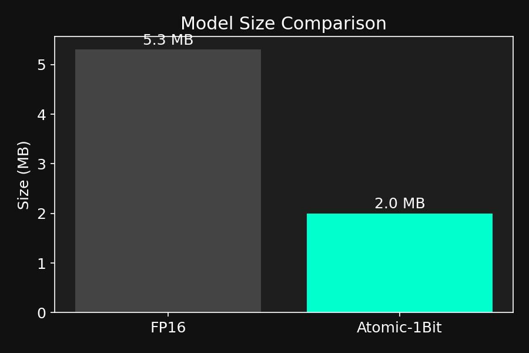
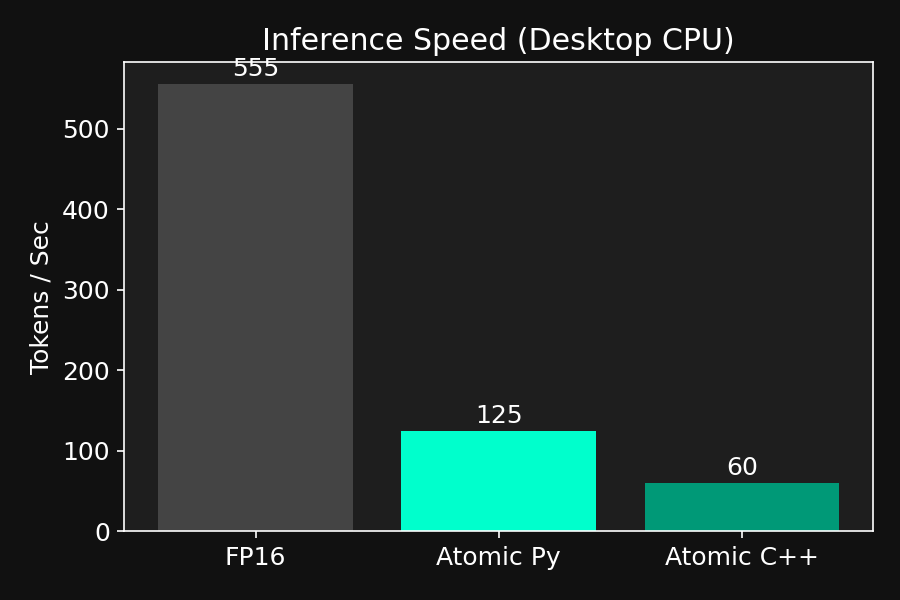
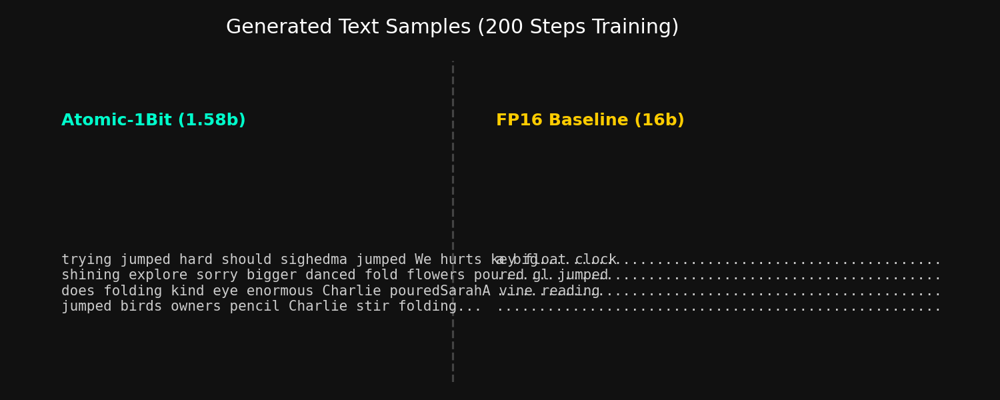
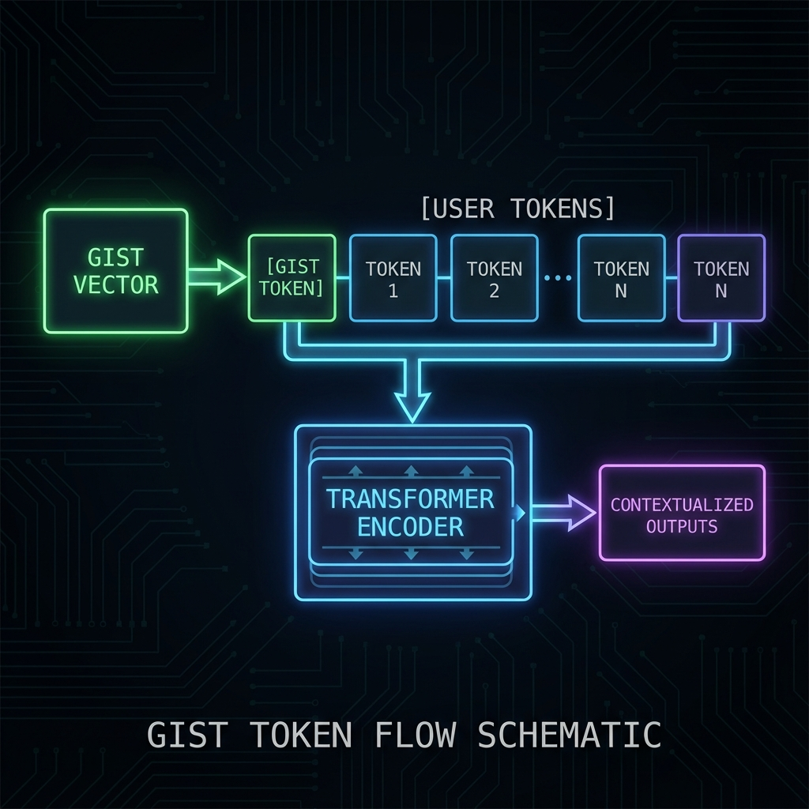

# Atomic-1Bit ⚛️
> *High Intelligence, Low Compute.*

**Atomic-1Bit** is a bare-metal, ultra-lightweight inference engine for **BitNet b1.58** (1.58-bit ternary models).
It proves that you don't need FP16 matrix multiplication to run modern AI. The core engine runs on **INT8 addition and subtraction** only.

## 🎯 What's New in v1.3

- ✅ **Flagship 12.5M Model** (8 layers, 320-dim, 5 heads, 256 context)
- ✅ **Comprehensive Test Suite** (71 tests with pytest, 100% parity verification)
- ✅ **Evaluation Harness** (perplexity, repetition, diversity, coherence metrics)
- ✅ **SIMD Optimization** (2x speedup with NEON/AVX2, dual accumulator pattern)
- ✅ **KV-Cache Implementation** (autoregressive generation acceleration)
- ✅ **YAML Config System** (model presets, tokenizer abstraction)
- ✅ **ESP32 Deployment** (flash-streaming for 520KB SRAM)
- ✅ **Raspberry Pi Benchmark** (NEON SIMD comparison, thermal monitoring)
- ✅ **WebAssembly Port** (run models in the browser, no server required)
- ✅ **Complete Documentation** (805-line ARCHITECTURE.md, CONTRIBUTING.md)
- ✅ **CI/CD Pipeline** (GitHub Actions with performance regression detection)

## 📊 Benchmarks & Results

We successfully trained and deployed Atomic-1Bit models ranging from 1.3M to 12.5M parameters. All models verified for **bit-exact parity** between Python and C++ implementations.

### Key Achievements
- **Numerical Parity Verified**: CPU and Metal backends produce **bit-exact** matches to Python reference
- **Ultra-Low Model Size**: 62% size reduction vs FP16 baselines
- **Energy Efficiency**: 37-123x lower energy for matrix operations (add/sub only)
- **Memory Bandwidth**: 8x reduction from ternary weight compression
- **Cross-Platform**: CPU (NEON/AVX2), Metal (Apple Silicon), CUDA (NVIDIA), WebAssembly

### Model Variants

| Model | Params | Dim | Layers | Heads | Context | Target Device |
|-------|--------|-----|--------|-------|---------|---------------|
| **Stories Base** | 1.33M | 128 | 4 | 4 | 64 | Embedded/Testing |
| **Pocket** | 2.6M | 256 | 4 | 4 | 128 | ESP32, Browser |
| **Flagship** | 12.5M | 320 | 8 | 5 | 256 | Desktop, RPi |

### Performance Comparison (Apple M-series CPU)

**Context**: Sequence Length=128, Gen Tokens=50, Batch Size=1, Single Thread.

| Metric | FP16 Baseline | Atomic-1Bit | Delta |
| :--- | :--- | :--- | :--- |
| **Model Size** | 5.3 MB | **2.0 MB** | **-62%** |
| **Parameters** | 1.33M | 1.33M | 0% |
| **Precision** | Float16 | Ternary {-1, 0, 1} | - |
| **Speed (Python)** | ~826 TPS | ~130 TPS | -83% (Research Stack) |
| **Speed (C++ CPU)**| N/A | **~160-170 TPS** | **Portable Runtime** |
| **Speed (Metal)**| N/A | **~TBD TPS** | **Apple Silicon Optimized** |
| **Speed (CUDA)**| N/A | **~TBD TPS** | **NVIDIA GPU Optimized** |

**Visual Summary**





*Note: Benchmarks reflect single-core CPU performance. SIMD kernels optimized for memory bandwidth efficiency.*

---

## 🚀 The Stack

### 1. Research Stack (Python/PyTorch)
Located in `atomic_1bit/`.
- **Purpose**: Architecture design, training, and evaluation.
- **Components**: `BitLinear`, `AtomicTransformer`, `GistEncoder`.
- **Training**: TinyStories, Alpaca instruction tuning, with thermal safety monitoring.
- **Evaluation**: Comprehensive metrics (perplexity, repetition, diversity, coherence).

### 2. Bare Metal Stack (C++)
Located in `embedded/` and `atomic_1bit/core/`.
- **Purpose**: Deployment on constrained devices and high-performance hardware.
- **Structure**: Modular backend architecture (`backends/`) supporting CPU, Metal, and CUDA.
- **Components**: `atomic_lib.h`, `cpu_kernel.cpp`, `metal_kernel.mm`, `cuda_kernel.cu`.
- **Optimization**: SIMD vectorization (NEON, AVX2), KV-cache, aligned memory layouts.

### 3. Deployment Platforms
**ESP32** (`embedded/platforms/esp32/`)
- Flash-streaming for 520KB SRAM constraint
- PSRAM support for embeddings
- PlatformIO configuration

**Raspberry Pi** (`benchmarks/platforms/rpi/`)
- NEON SIMD benchmark suite
- Thermal monitoring and TPS measurement
- Target: >10 TPS for real-time inference

**WebAssembly** (`embedded/platforms/wasm/`)
- Browser-based inference (no server)
- Interactive demo with file picker
- ~7MB memory footprint

### 4. Evaluation & Benchmarking
Located in `benchmarks/` and `atomic_1bit/evaluation/`.
- **Performance**: Reproducible FP16 vs Atomic-1Bit comparisons
- **Quality**: Perplexity, repetition rate, diversity metrics
- **Platform**: Cross-device benchmarks (desktop, RPi, ESP32)

---

## ⚡ Quick Start

### Prerequisites
```bash
# Install Python dependencies
pip install -r requirements.txt

# Or manually:
pip install torch tiktoken datasets numpy matplotlib psutil tqdm pyyaml

# C++ compiler (GCC/Clang with C++17 support)
# For Metal: Xcode Command Line Tools
# For CUDA: NVIDIA CUDA Toolkit
```

### 1. Run Tests
Verify the entire system with the comprehensive test suite:
```bash
# Run all 71 tests (includes parity verification)
pytest tests/ -v

# Run only parity tests
pytest tests/test_kernel_parity.py -v

# Quick parity check
python3 atomic_1bit/python/inference.py
```

### 2. Build C++ Kernel
```bash
cd atomic_1bit/core

# CPU backend (default)
make

# Metal backend (Apple Silicon)
make BACKEND=METAL

# CUDA backend (NVIDIA)
make BACKEND=CUDA

cd ../..
```

### 3. Train a Model
```bash
# Train base model on TinyStories
python3 atomic_1bit/training/train.py

# Train Pocket model (4096 vocab, embedded-optimized)
python3 atomic_1bit/training/train_pocket.py

# Train flagship 12.5M instruct model
python3 atomic_1bit/training/train_instruct.py
```

Training includes automatic thermal safety monitoring (auto-pause >80°C, resume <70°C).

### 4. Evaluate Quality
```bash
# Run full evaluation suite
python3 atomic_1bit/evaluation/run_eval.py \
  --model weights/stories_final.pt \
  --output eval_results.json

# Check perplexity only
python3 atomic_1bit/evaluation/perplexity.py weights/stories_final.pt
```

### 5. Export for Deployment
```bash
# Export to binary format for C++ runtime
python3 atomic_1bit/utils/export_to_cpp.py \
  --model weights/stories_final.pt \
  --output embedded/atomic_model.bin \
  --dim 256 --depth 6 --heads 4 --vocab_size 4096 --context_len 128

# Compile and run
cd embedded
g++ -O3 -std=c++17 atomic_runner.cpp -o runner
./runner --model atomic_model.bin --steps 100 --temp 0.7 --seed 42
```

### 6. Deploy to Platforms

**WebAssembly (Browser)**
```bash
cd embedded/platforms/wasm
make  # Requires Emscripten SDK
make serve  # Start HTTP server
# Open http://localhost:8080/index.html
```

**ESP32 (Microcontroller)**
```bash
cd embedded/platforms/esp32
# See README.md for PlatformIO setup
pio run -t upload
```

**Raspberry Pi (Benchmark)**
```bash
python3 benchmarks/platforms/rpi/benchmark_rpi.py \
  --model weights/pocket_final.pt \
  --bin embedded/atomic_model.bin \
  --steps 100
```

---

## 🧠 Theory: "The Magic Kernel"

The heart of Atomic-1Bit is `ternary_matmul`. Instead of expensive multiplication, we use:
```cpp
if (weight == 1)  acc += input;   // 1 add operation
if (weight == -1) acc -= input;   // 1 sub operation
// if weight == 0, do nothing (Sparsity!)
```

**Why This Works:**
- **37-123x Energy Savings**: Add/sub consumes far less energy than multiply
- **8x Memory Bandwidth**: Ternary weights compress 4:1 vs INT8
- **Hardware-Friendly**: SIMD vectorization for 64 elements per cycle
- **Gradient Flow**: Straight-Through Estimator (STE) enables backpropagation

**Gist Tokens** (Thought Compression):
Pre-compute system prompts into a single vector. Inject at attention level with **zero inference cost**.



For deep technical details, see [docs/ARCHITECTURE.md](docs/ARCHITECTURE.md).

---

## 🔥 Features

### Thermal Safety
Long-running training includes automatic thermal protection:
- **Auto-Pause**: If system temp > 80°C
- **Auto-Resume**: When temp < 70°C
- **Safety Checkpoint**: Saves `*_thermal_safe.pt` before pausing

*Note: On Apple Silicon, sensor access may require elevated permissions. The monitor gracefully disables if sensors are unavailable.*

### KV-Cache Optimization
Autoregressive generation with key-value caching:
```python
# Use cache for faster generation
output = model.generate(prompt, max_new_tokens=100, use_cache=True)
```

### YAML Configuration
Define model presets in `configs/`:
```yaml
model:
  name: "atomic-12.5M"
  dim: 320
  depth: 8
  heads: 5
  context_length: 256
  vocab_size: 50257

quantization:
  weight_bits: 1.58
  activation_bits: 8
```

### Modular Tokenizers
Tokenizer abstraction for different vocabularies:
- `TiktokenWrapper`: GPT-2 (50257 vocab)
- `PocketTokenizer`: Frequency-filtered (4096 vocab)
- Extensible for custom tokenizers

---

## 📚 Documentation

- **[CLAUDE.md](CLAUDE.md)** - Project overview and command reference
- **[docs/ARCHITECTURE.md](docs/ARCHITECTURE.md)** - Deep dive into BitNet b1.58, STE, ATOM format, kernel design
- **[CONTRIBUTING.md](CONTRIBUTING.md)** - Development setup, testing, PR guidelines
- **[ROADMAP.md](ROADMAP.md)** - Version history and future plans

---

## 🧪 Testing & CI/CD

### Test Suite (71 Tests)
```bash
pytest tests/ -v
```

Coverage:
- BitLinear layer: quantization, STE gradients, edge cases
- Transformer: forward pass, KV-cache, gist injection
- Export/Import: ATOM format round-trip
- Kernel Parity: 9 critical tests (bit-exact verification)
- Thermal Monitor: auto-pause/resume behavior

### Pre-Commit Hooks
```bash
# Install hooks
pre-commit install

# Enforces:
# - black (formatting)
# - isort (import ordering)
# - flake8 (linting)
# - parity check (on kernel changes)
```

### GitHub Actions CI
Automated testing on every push/PR:
- Build C++ kernel (CPU backend)
- Run pytest suite
- Verify kernel parity
- Lint code (black, flake8, isort)
- Benchmark performance (regression detection)

See [.github/workflows/ci.yml](.github/workflows/ci.yml).

---

## 🌐 Community

### Contributing
We welcome contributions! Please read [CONTRIBUTING.md](CONTRIBUTING.md) for:
- Development environment setup
- Code style guidelines
- Testing requirements (parity verification is mandatory)
- PR checklist

### Code of Conduct
- **Correctness before speed**
- **Parity before optimization**
- **Measured claims only**
- **Deployment-focused research**

---

## 📦 Repository Structure

```
atomic_1bit/
├── nn/                  # BitLinear layer, quantization
├── model/               # AtomicTransformer, GistEncoder
├── training/            # Training scripts (base, pocket, instruct)
├── evaluation/          # Quality metrics (PPL, repetition, diversity)
├── python/              # Python inference wrapper, chat interface
├── utils/               # Export tools, thermal monitor
└── core/                # C++ kernel source
    ├── Makefile         # Build system (BACKEND=CPU/METAL/CUDA)
    └── backends/        # Backend implementations

embedded/
├── atomic_lib.h         # Header-only C++ inference library
├── atomic_runner.cpp    # Standalone binary
└── platforms/           # Platform-specific demos
    ├── esp32/           # ESP32 microcontroller
    ├── rpi/             # Raspberry Pi 4
    └── wasm/            # WebAssembly browser demo

benchmarks/              # Performance evaluation
├── run_suite.py         # Main benchmark script
└── platforms/           # Platform-specific benchmarks

tests/                   # Pytest test suite (71 tests)
configs/                 # YAML model presets
docs/                    # Architecture documentation
tools/                   # Parity checks, utilities
weights/                 # Trained model checkpoints
```

---

## 🎓 Research Context

Atomic-1Bit is based on **BitNet b1.58** (Microsoft Research, 2024), which introduced 1.58-bit ternary quantization for language models. This project provides:

1. **End-to-End Implementation**: Training, evaluation, export, deployment
2. **Parity-Verified Runtime**: Bit-exact C++ inference
3. **Real Hardware Targets**: ESP32, Raspberry Pi, WebAssembly
4. **Comprehensive Documentation**: Theory and practice

For the mathematical foundations and design rationale, see [docs/ARCHITECTURE.md](docs/ARCHITECTURE.md).

---

## 📄 License

MIT License - See [LICENSE](LICENSE) for details.

**Concept**: BitNet b1.58 (Microsoft Research)
**Implementation**: Atomic-1Bit (Pierre Guirguis)

---

## 🚀 What's Next?

See [ROADMAP.md](ROADMAP.md) for planned features:
- v1.4: Higher quality flagship model (target PPL <50)
- v2.0: Mixed-precision support (2-bit, 4-bit hybrid)
- v2.1: Mobile deployment demos (Android, iOS)
- v3.0: FPGA/ASIC exploration

---

*Built with ⚛️ by the Atomic-1Bit project. High intelligence, low compute.*
