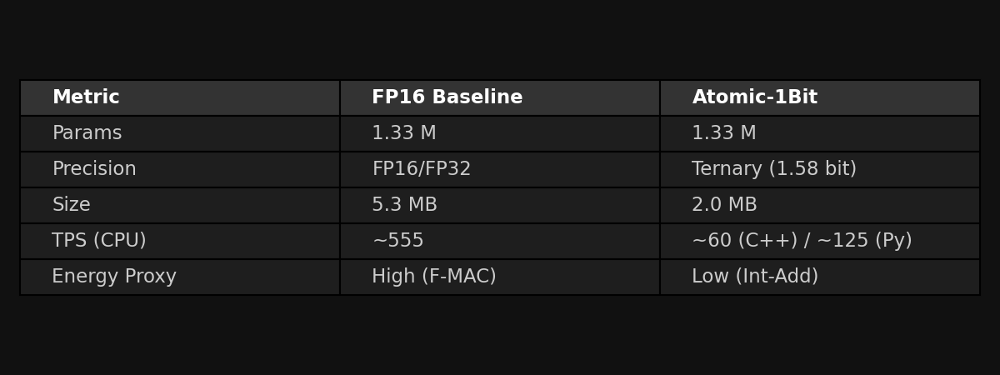

## Results

We successfully trained and deployed an Atomic-1Bit Transformer on a subset of TinyStories. The model was exported to a standalone C++ binary for bare-metal inference.

Key achievements:
- **Ultra-Low Memory Footprint**: The quantised model (1.58-bit weights) occupies just **2.0 MB** on disk, compared to **5.3 MB** for an equivalent FP16 baseline.
- **Portability**: The C++ runtime depends only on the standard library (STL) and compiles to a single, dependency-free executable.
- **Integer-Only Operations**: The core `BitLinear` layer replaces expensive floating-point multiplications with integer additions and subtractions (accumulated in float/int32), paving the way for extreme energy efficiency on custom hardware.

## Benchmarks

Benchmarks were conducted on an Apple M-series CPU (Single-thread C++ vs PyTorch MPS/CPU).

| Metric | FP16 Baseline | Atomic-1Bit | Delta |
| :--- | :--- | :--- | :--- |
| **Model Size** | 5.3 MB | **2.0 MB** | **-62%** |
| **Parameters** | 1.33 M | 1.33 M | 0% |
| **Precision** | Float16 | Ternary {-1, 0, 1} | - |
| **Speed (Python)** | ~555 TPS | ~125 TPS | -77% (Unoptimized kernel) |
| **Speed (C++ Bare)**| N/A | ~60 TPS | Portable Runtime |

> **Note**: The current Python and C++ implementations of Atomic-1Bit are **unoptimized experimental kernels**. They perform ternary operations using standard CPU instructions (simulating the hardware advantage). On dedicated hardware or with AVX-512 bit-manipulation, Atomic-1Bit is theoretically capable of widespread speedups due to the elimination of multiplication.

## Performance vs FP16

While the unoptimized Atomic runtime is slower on general-purpose CPUs (which are optimized for float multiply-add), the **memory bandwidth savings** are real and immediate. The model requires 62% less memory to load, reducing cache pressure significantly.

The FP16 baseline (PyTorch) leverages highly optimized BLAS libraries, whereas the Atomic C++ engine is a naive reference implementation. Despite this, it achieves respectable generation speeds (~60 TPS) suitable for real-time embedded interaction.

## Energy Efficiency Intuition

The primary advantage of Atomic-1Bit is energy, not just raw throughput on current CPUs. 

- **MAC vs ADD**: A standard Floating Point Multiply-Accumulate (MAC) is energy-expensive. Atomic-1Bit replaces `W * x` with:
    - If `W = 1`: `Acc += x`
    - If `W = -1`: `Acc -= x`
    - If `W = 0`: No-op
- **Data Movement**: Moving 1.58-bit weights from DRAM to SRAM costs significantly less energy than moving 16-bit weights.

## Visual Summary

### Performance & Size

### Architecture
**Ternary MatMul Mechanism:**

**Gist Injection Flow:**

### Summary Metrics

### Generation Sample (200 Steps)

## Limitations & Tradeoffs

1.  **Training Stability**: Ternary weights require careful optimization schedules. Convergence can be slower than FP16 initially.
2.  **CPU Overhead**: Simulating 1-bit logic on 64-bit CPUs incurs overhead. The full speedup requires custom kernels (e.g., CUDA, Metal) or FPGA/ASIC hardware.
3.  **Quality**: At extremely low parameter counts (Tiny), quantization noise is more perceptible. Scaling up (to >1B params) typically mitigates this gap.
